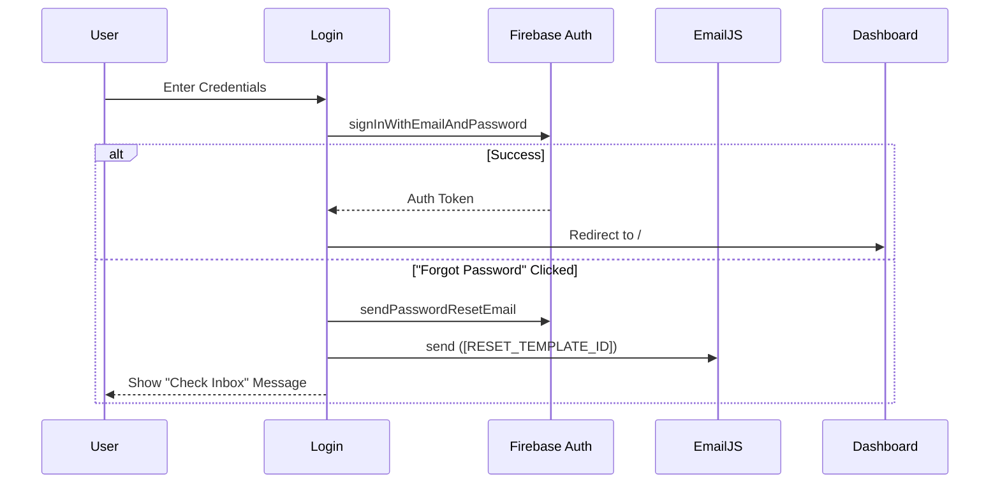

# Control Flow - RAGA HealthCare

This document describes the execution flow and navigation logic of the application.

## 1. Authentication Flow

The application follows a strict initialization sequence to ensure secure data access:

## 2. Navigation & Routing

The `Layout` component wraps all internal routes and provides the Sidebar/Navbar.

*   **Public Routes**: `/login` (Accessible only when unauthenticated).
*   **Protected Routes**: All others (Requires active Firebase Auth session).
*   **Role-Based Access**:
    *   `Admin`: Full access to Doctors, Patients, Analytics, and Admin Utilities.
    *   `Doctor`: Access to Patients, Schedule, and Analytics.

## 3. Data Fetching Strategy

The application uses **React Hooks** combined with **Firestore Services**:

1.  **Component Mount**: Triggers `useEffect`.
2.  **Service Call**: Invokes methods from `patientService.ts` or `doctorService.ts`.
3.  **State Update**: Service returns data -> Component updates local state.
4.  **Re-render**: UI updates with smooth `animate-in` transitions.

## 4. Error Handling Flow

When an operation (like fetching or updating) fails:

1.  The service catches the Firestore/Auth error.
2.  The component catches the error and updates the `error` state.
3.  A **Premium Alert Banner** (rose/red) is displayed with descriptive text.
4.  If the error is related to credentials, the system suggests contacting an administrator.

---

© 2026 RAGA HealthCare Systems. All rights reserved.
