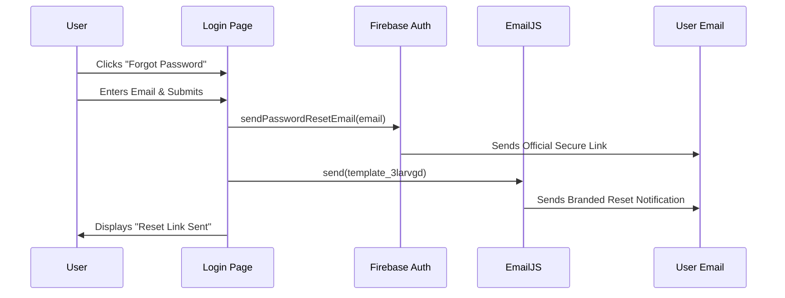
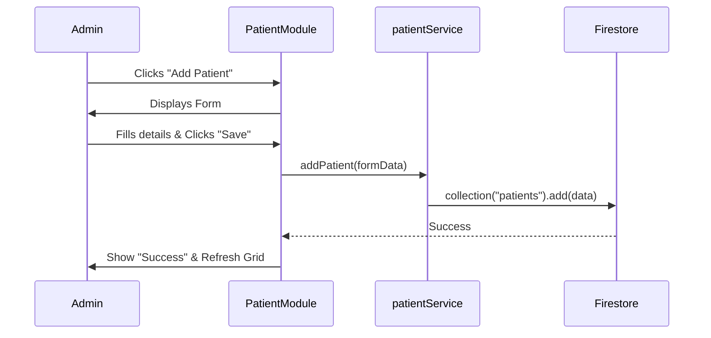
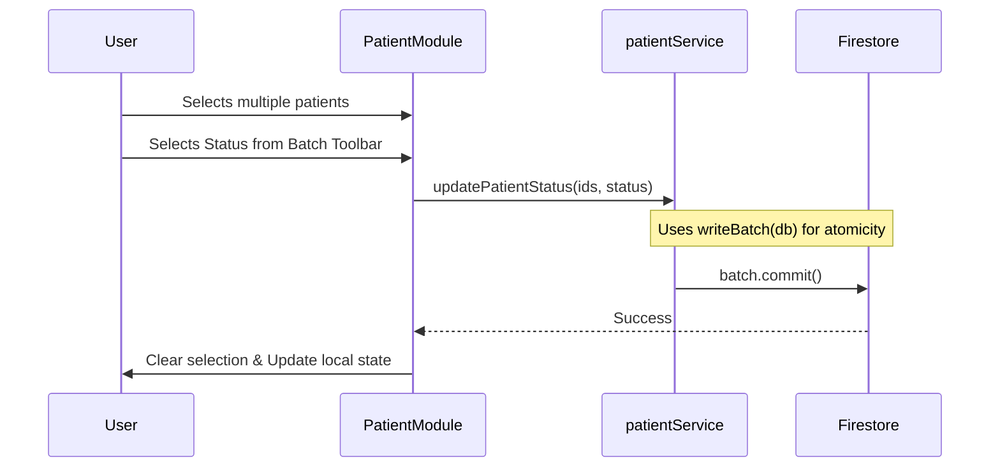

# Sequence Diagrams - RAGA HealthCare

Visual representations of critical workflows in the system.

## 1. Automated Password Reset Flow

Describes the secure dual-notification process when a user loses access.

## 2. Patient Registration Flow

Describes the interaction between the Admin and the Backend when registering a new patient.

## 3. Bulk Status Update Flow

How multiple patient records are updated in a single transaction-like batch.

---

© 2026 RAGA HealthCare Systems. All rights reserved.
