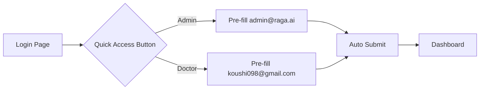
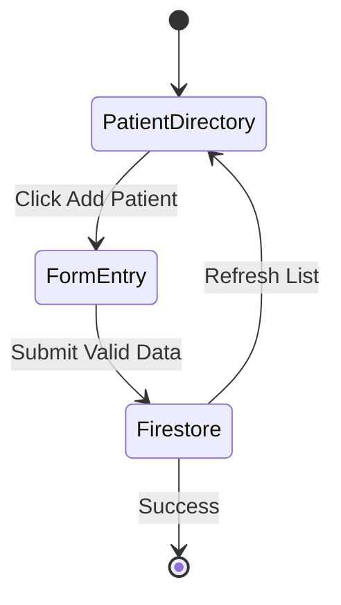
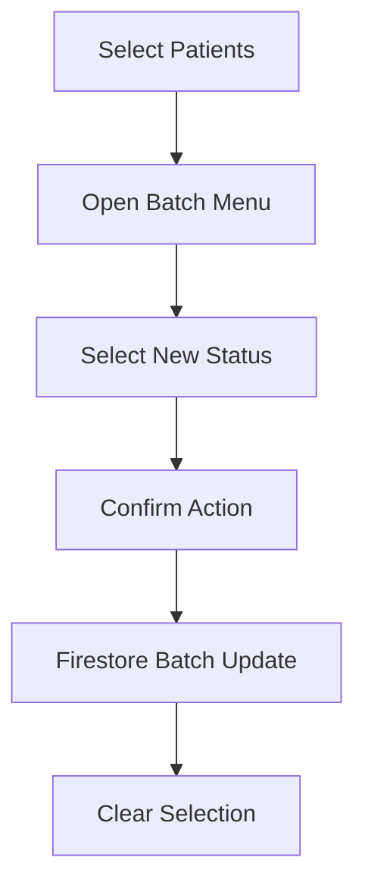
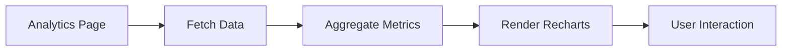

# Use Cases - RAGA HealthCare

This document outlines the primary use cases and user interactions within the RAGA HealthCare platform.

## 1. Authentication & Access

### UC-1.1: Quick Access Login
*   **Actor**: All Users
*   **Description**: Instantly log in using pre-configured demo accounts.

### UC-1.2: Password Recovery
*   **Actor**: All Users
*   **Description**: Recover access to a locked account via email.

---

## 2. Patient Management

### UC-2.1: Register New Patient
*   **Actor**: Admin
*   **Description**: Register a new patient into the system with demographic and clinical details.

### UC-2.2: Bulk Status Update
*   **Actor**: Admin, Doctor
*   **Description**: Update the clinical status of multiple patients simultaneously.

---

## 3. Doctor & Scheduling

### UC-3.1: Manage Staff Profiles
*   **Actor**: Admin
*   **Description**: Seed or update doctor records and specializations.

### UC-3.2: Analytics Monitoring
*   **Actor**: Admin, Doctor
*   **Description**: Monitor patient flow trends and recovery rates.

---

© 2026 RAGA HealthCare Systems. All rights reserved.
